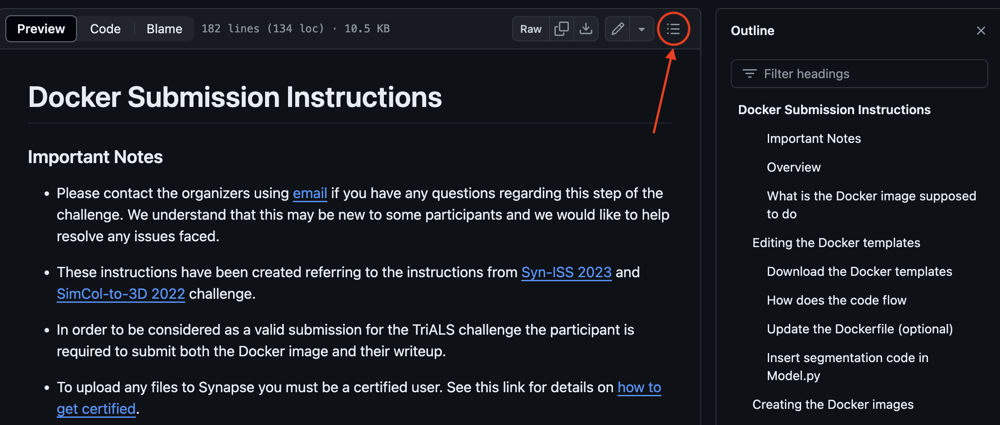

# Docker Submission Instructions

*Useful tip: view the page outline / table of contents by clicking the icon shown in image below*



### Important Notes
* Please contact the organizers using [email](mailto:mkfmelbatel@connect.ust.hk) if you have any questions regarding this step of the challenge. We understand that this may be new to some participants and we would like to help resolve any issues faced.

* These instructions have been created referring to the instructions from [Syn-ISS 2023](https://www.synapse.org/#!Synapse:syn50908388/wiki/621840) and [SimCol-to-3D 2022](https://www.synapse.org/#!Synapse:syn28548633/wiki/617244) challenge. 

* In order to be considered as a valid submission for the TriALS challenge the participant is required to submit both the Docker image and their writeup. 

* To upload any files to Synapse you must be a certified user. See this link for details on [how to get certified](https://help.synapse.org/docs/Synapse-User-Account-Types.2007072795.html#SynapseUserAccountTypes-CertifiedUser). 

### Overview
This document covers the details related to creating the docker images for submitting to the TriALS sub-challenge.

### What is the Docker image supposed to do
The docker image should read the test data identifiers from a CSV file and look for the corresponding images in the input directory specified when running the docker container. The docker container should write the predicted masks as image files to the specified output directory as well.

The docker templates already provide a Dockerfile to do this. Below are instructions about using the provided docker templates: (1) where the participant's should place their code, and (2) how they can generate a docker image for submission. The same instructions apply for task 1 and task 2. 

## Editing the Docker templates 

### Download the Docker templates
The docker templates can be obtained in one of the following ways:
1. Downloading `.zip` archives of the templates from the [latest release](https://github.com/xmed-lab/TriALS/releases/latest).
2. Downloading the entire GitHub repository locally. Please follow [this URL](https://github.com/xmed-lab/TriALS.git) to get the repository files.
3. Cloning the GitHub respository using a Git client. 

### How does the code flow
Before editing the docker template here is information about how the Docker template executes.  
1. The `Dockerfile` is set up to launch the `run.sh` file as the entry point. Any other entrypoint will be ignored.
2. The `run.sh` script expects three inputs:
    * a path to csv file containing list of test image identifiers,
    * a path to a folder where the test image files can be found, and
    * a path to a folder where the image files containing the predicted masks will be written to.
3. The `run.sh` calls the Python script `main.py` passing along these three input parameters to it.
4. The `main.py` script imports the segmentation model `MySegmentation` from the `Model.py` file.
6. The `Model.py` file contains the segmentation functionality to take an input image and produce a segmentation mask for the current task.

**Note:** We provide a sample model trained under `nnUNet_results` (located at `template/src/nnUNet_results`). You can download it from [this link](https://drive.google.com/drive/folders/1G53ttrukdTpdQLIgsW55VZbb_1adoD8g?usp=sharing) and place it in `template/src/nnUNet_results`.

```
├── nnUNet_results/
│   ├── Dataset102_TriALS/
│   │   ├── nnUNetTrainer__nnUNetPlans__3d_fullres
│   │   │   ├── ...
```

Now, let us edit the Docker template files. 

### Update the Dockerfile (optional)
Please update the `Dockerfile` to specify any base image that your code needs like PyTorch, Tensorflow, NVidia. 
This done by adding a [`FROM` instruction](https://docs.docker.com/engine/reference/builder/#from).
For example, this is how the docker container can be instructed to use the tensorflow base image.
```Docker
FROM tensorflow/tensorflow
```
A catalog of base images can be found in the [Docker Hub](https://hub.docker.com/search?image_filter=official&q=&type=image).

### Insert segmentation code in Model.py
Please insert your model related code in the Python script `Model.py` within the `MySegmentation` class.
Commented blocks specifying the region in the code flow of the `segment()` function are provided in the template. Here is an example of such a comment block:


## Creating the Docker images
Now that the docker template has been updated to include your model related changes in it, the following instructions will guide you in creating a docker image that you need to submit to the challenge. 

### Have you done the following
* Set up Docker on your machine. Please refer to the Docker Guide for instructions on how to [get started with Docker](https://docs.docker.com/get-docker/).
* Downloaded the Docker template. These are located under the `docker/template` folder.
* Updated the files in the Docker template following the [instructions](#editing-the-docker-templates).

Please finish the above listed tasks before proceeding further.

### Building the Docker image

Build the docker image by following these steps:
* Open a command line tool.
* Browse to the directory where the `Dockerfile` is located.
* Run the following command to build the image (please check that you have included the `.` at the end of the command).
```Docker
$ docker build -t <image-name> . 
```
where,<br>
`image-name` is the name to be given to the docker image created. 

The docker image must be named using the following format.
```
trials-<task-name>-<team-name>:<version>
```
where,<br>
`task-name` is either "task1" or "task2",<br>
`team-name` is the team abbreviation that was provided during registration,<br>
`version` is the version number of the image starting from `v1` and increasing as you submit newer versions of the image.<br>

Note: the highest version number tagged image will be used for the final evaluation of your model. 

As an example, a team named "medhacker" submitting a second version of their Docker image for the binary segmentation task "task1" must name their Docker image as `trials-task1-medhacker:v2`.


### Testing Docker image
It is recommended that you verify the docker image built to ensure it works as intended before submitting to the challenge.
Sample volume are available to do this with proper file and folder names that the organizers will use for evaluating the submissions using the test dataset. 
The sample images are located in the Docker template folders within a subfolder named `sample-test-data`. 
You can test by running the docker image using the following command in a command line tool. 
```bash
$ docker run -it --rm -v "<path-to-sample-test-data>:/data" <image-name> /data/test.csv /data/inputs /data/predictions 
```
where,<br>
`path-to-sample-test-data` is the location of the sample test data folder on the machine that is being used to test the Docker image,<br>
`image-name` is the name of the Docker image being tested.

## Submitting the Docker images

At any point in the following steps if more information related to Synapse is needed then refer to the [Docker Registry documentation page](https://help.synapse.org/docs/Synapse-Docker-Registry.2011037752.html).

### Create a Synapse project
To submit files to a challenge on Synapse you need to create a Synapse project first. The project must be named using the challenge name and team names as shown below.
```
TriALS-MedHacker
```
The Synapse documentation can be referred to [create a project](https://help.synapse.org/docs/Setting-Up-a-Project.2055471258.html#SettingUpaProject-CreatingaProject).

Please add the team named [`TriALS 2024 Admin`](https://www.synapse.org/Team:3491688) to the project and give them "Download" permissions. Follow the documentation on how to [share a project](https://help.synapse.org/docs/Sharing-Settings,-Permissions,-and-Conditions-for-Use.2024276030.html#SharingSettings,Permissions,andConditionsforUse-EditSharingSettingsonaProject). 

### Login to Synapse in Docker
* Type the following in a command line tool to login to synapse using docker.
```bash
$ docker login -u <username> docker.synapse.org
```
* Enter your synapse account password when prompted. 

### Tag the Docker image 
This step requires your new project's Synapse ID. This can be found by looking at the web URL for the project page. For example, the Synapse ID of the project at the URL https://www.synapse.org/#!Synapse:syn150935 is `syn150935`.

Type the following in a command line tool to tag the docker image before uploading to Synapse. 
```bash
$ docker tag <image-name> docker.synapse.org/<synapse-project-ID>/<image-name>
```
where, <br>
`image-name` is the name of the Docker image being prepared for submission to the challenge,<br>
`synapse-project-ID` is the Synapse ID of your project that is being used to submit to the TriALS challenge, e.g., syn150935.

### Push the Docker image to Synapse
Type the following in a command line tool to push the tagged local Docker image so that it appears in your Synapse project.  
```bash
$ docker push docker.synapse.org/<synapse-project-ID>/<image-name>
```
where, <br>
`synapse-project-ID` is the Synapse ID of your project that is being used to submit to the TriALS challenge, e.g., syn150935, <br>
`image-name` is the name of the Docker image being prepared for submission to the challenge.

> [!IMPORTANT]
> This command will fail if your Synapse user account is not a certified user account. See this link for details on [how to get certified](https://help.synapse.org/docs/Synapse-User-Account-Types.2007072795.html#SynapseUserAccountTypes-CertifiedUser).

### Verify Docker image on Synapse
The Docker images for a project appear under the Docker navigation tab of the project. See the example image below.


### Submit Docker image to challenge
* Under the Docker tab of your Synapse project click the Docker image that you want to submit to the challenge. 

* Click the `Docker Repository Tools` button and select `Submit Docker Repository to Challenge` in the menu. See reference image below. 


* Select the version that you want to submit. 

* On the next page, select the challenge task that you want to submit the Docker image to. See image below. 

<div style="text-align: center;">
    
</div>


* Then, select the option: `I am submitting as an individual`.<br>
Ignore the team submission option even though you are part of a team. The organizers have the information about the team through the email registration process. 

* You will receive a confirmation email once the docker submission has been validated by the organizers.  

Thank you!